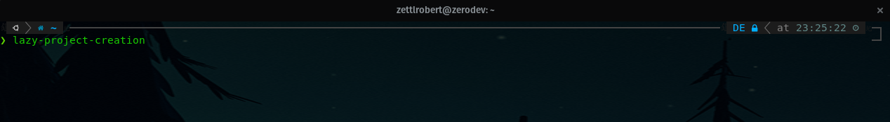
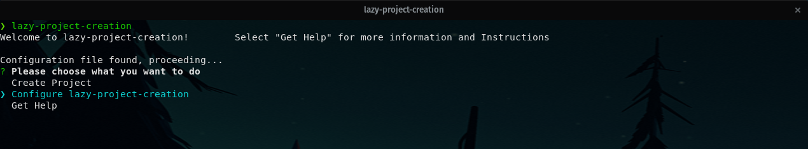
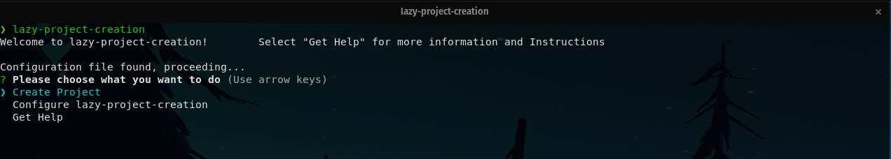

# lazy-project-creation
# $ npm i -g lazy-project-creation

lazy-project-creation creates a local project in a workspace of your choice.
In addition it will initialize a local repository, and create a remote github repository with the same name and after your configuration.
It will then proceed to create a .gitignore, add the remote, add files, setup an initial commit which it finally pushes.

**The basic functionality as stated will be available in April. I am currently working on the github integration and it is nearly done!**

## Needs to be installed globally, works on Unix based Systems!!!

### lazy-project-creation is my first cli tool provided as npm package: [https://www.npmjs.com/settings/zettlrobert/packages](https://www.npmjs.com/package/lazy-project-creation)

## Setup and Configuration
1. **Install it globally!**
1. On it's first execution it will setup the needed configuration files, call it again to use!
1. lazy-project-configuration uses a local configuration file, so your data stays with you!
1. you need to configure and setup lazy-project-creation before using it to create projects
   1. you can edit the configuration file manually but it is recommended to use the tool (~/.config/lazy-project-creation/userConfig.json)
   1. to use the remote functionality you will have to add your github username and a personal access token. 
1. the default workspace is your home directory (change it according to your preferences)
1. follow the configuration steps provided by lazy-project-creation 
1. use a complete, absolute path for each workspace
1. to create a github repository and link it with your local project you need to provide a personal access token, it will only be stored in the config file on your system.

## Call it

## Configure once (unless you want to change configuration)

## Enjoy

### Basic Information
* the configuration file is located ~/.config/lazy-project-creation/userConfig.json
* the default workspace location is ~/

## System Requirements
1. Nodejs
2. npm

## How to install

      $ npm i -g lazy-project-creation

#### [If you have suggestions or something is not working as expected let me know!](https://zerodev.dev/contact)

### Planned Features
* github integration
  * after github integration is implemented, bitbucket, gitlab will follow...
  * project overview, creating remote repos from existing projects

* Windows integration(maybe)

* might choose to rewrite in "go" as when i am more familiar with that language. 